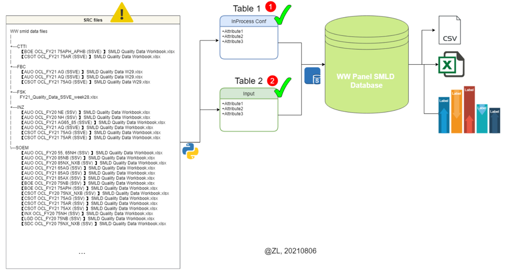
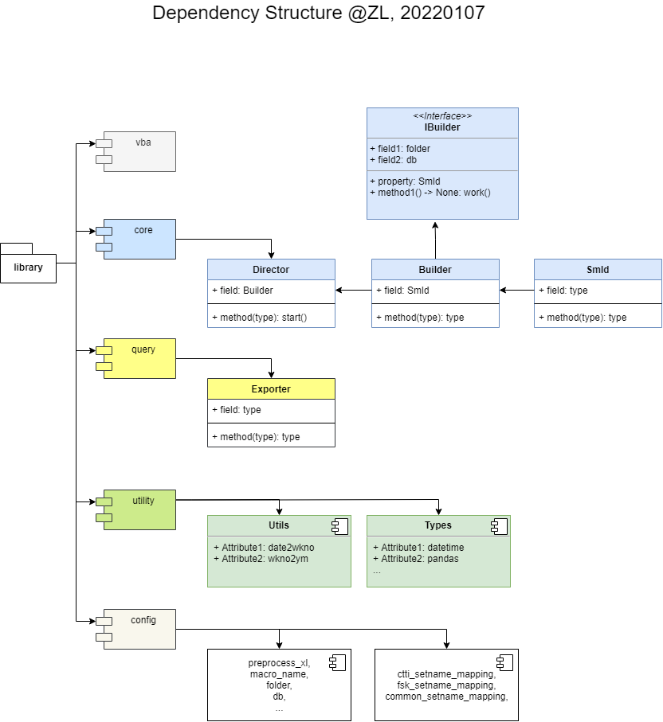

# WW Pmod SMLD Quality Control System

This project builds, maintains a database, and monitors SSVE Pmod performance by week.

It minimizes significant labor hours, eliminates human errors and speeds up the whole process.

This project makes monitoring WW Pmod SMLD Quality in real time possible.

## Author

SSVE TVQA member `@Zhang Liang`, 20210804

## Changelog

- v0.01, initial build
- v0.02, clean and format algorithms
- v0.03, change design pattern: split into two dataframes: defects, inputs
- v0.04, add more columns to prepare for visualization
- v0.05, fix TVPlant column, "SO'EM" -> "SOEM"
- v0.06, add an option to run `main.py` by using `main.bat` (Batch script)
- v0.07, refactor the core using `Builder` design pattern
- v0.08, restructure the dependency structure (divide-and-conquer)

## Schema



## Project structure

```Batch

C:.
│  .gitignore
│  20210806 WW_Panel_SMLD_Database v0.02.pptx
│  main.bat
│  main.py
│  requirements.txt
│      
├─data
│  ├─CTTI
│  │      【BOE OCL_FY21 75APH_APHB (SSVE) 】 SMLD Quality Data Workbook.xlsx
│  │       ...
│  │      
│  ├─FBC
│  │      【AUO OCL_FY21 AG (SSVE) 】 SMLD Quality_W49.xlsx
│  │       ...
│  │      
│  ├─FSK
│  │      FY21_Quality_Data_SSVE_week50.xlsx
│  │      
│  ├─INZ
│  │      【AUO OCL_FY20 NH (SSV) 】 SMLD Quality Data Workbook.xlsx
|  |       ...
│  │      
│  └─SOEM
│          【AUO OCL_FY20 55, 65NH (SSV) 】 SMLD Quality Data Workbook.xlsx
│          【AUO OCL_FY20 85NB (SSV) 】 SMLD Quality Data Workbook.xlsx
|           ...
│          
├─docs
│      design.png
│      DevelopManual.html
│      DevelopManual.md
│      DevelopManual.pdf
│      info.text
│      performance.png
│      smld_db.drawio
│      smld_db.png
│      SQL.png
│      
├─lib
│  │  core.py
│  │  __init__.py
│  │  
│  ├─config
│  │      config.py
│  │      setname_mapping.py
│  │      __init__.py
│  │      
│  ├─query
│  │      query.py
│  │      __init__.py
│  │      
│  ├─smld
│  │      smld.py
│  │      __init__.py
│  │      
│  ├─utility
│  │      types.py
│  │      utils.py
│  │      __init__.py
│  │      
│  └─vba
│          caller.py
│          SmldWrangler.xlsm
│          __init__.py
│          
├─reports
│      pmod_smld_viz_v0.09.xlsm
│      
└─test
        cleaned_headers.py
        df_replace.py
        ext.py
        field_names.py
        mon.py

```

## Design pattern

There was an impact to performance when using Python to clean "inputs" data in source files;

After built a VBA class API to preprocess the clean operation, the impact is alleviated;

### Pattern

- (Class) using `VBA` preprocess class API to do basic data cleaning;
- (Class) using `Python` + `Pandas` to build a DataFrame Merger API to wrangle the preprocessed source files with split control: "defects", "inputs";
- (Class) using `SQL` to control all data entries and poka-yoke duplicate entries;
- (Class) exports `SQL` database to excel "pmod_smld.xlsx" with unique columns for further data visualization;
- (Module) using `VBA` to visualise pmod smld data;



### Performance

The average run time of whole process is around 3 minutes.

* preprocess           : 46.50 seconds
* python->SQL database : 137.16 seconds
* SQL query            : 1.19 seconds

=> Performance: 184 seconds


### VBA preprocess class API

```VB

Option Explicit

Private Sub CPModWrangler()
    Dim FSO As New FileSystemObject
    Dim srcWB As Workbook
    Dim plant As String
    Dim rv As Variant
    Dim cpw As New CPModWrangler
    Dim subDir As Scripting.Folder
    Dim srcFile As Scripting.File
    Const tmp_flag As String = "~$"
    Const xl_flag As String = "xls"
    Dim root As String
    root = FSO.GetParentFolderName(FSO.GetParentFolderName(ThisWorkbook.path)) & Application.PathSeparator & "data"

    If root = vbNullString And Not FolderExists(root) Then
        MsgBox "DirNotFound", vbInformation, "NotFoundError"
        Exit Sub
    End If
    
    FastMode True
    'On Error Resume Next
    For Each subDir In FSO.GetFolder(root).SubFolders
        For Each srcFile In FSO.GetFolder(subDir).Files
            If InStr(srcFile.name, tmp_flag) < 1 And InStr(srcFile.name, xl_flag) > 1 Then
                Set srcWB = GetObject(srcFile)
                rv = Split(srcWB.FullName, Application.PathSeparator)
                plant = rv(UBound(rv) - 1)
                cpw.init srcWB, plant
                cpw.clean
                Set srcWB = Nothing
            End If
        Next
    Next
    Set FSO = Nothing
    FastMode False
End Sub

```

### Python DataFrame Merger API

Using Python to read all preprocessed files, and clean DataFrame further;

```Python

def main()->None:
    smld = Smld(
        fix_defects_setname=common_defects_setname, fix_defects_setname_mapping=common_defects_setname_mapping,
        fix_inputs_modelname=common_inputs_modelname, fix_inputs_modelname_mapping=common_inputs_modelname_mapping,
        fix_inputs_fy=common_inputs_fymod, fix_inputs_fy_mapping=common_inputs_fymod_mapping,
    )

    b = Builder(folder, db_web)
    b.smld = smld
    d = Director()
    d.builder = b

    logging.info("start preprocess..")
    try:
        caller.call_vba_macro(os.path.abspath(preprocess_xl), macro_name)
        logging.info("preprocess finished")
        try:
            logging.info("start Python -> SQL..")
            d.start()
        except:
            logging.info("PythonError: failed to merge source file")
    except:
        logging.info("VBAError: failed to clean source file")

    if os.path.exists(db_web):
        ex = query.Exporter(db_web, dst_xl_web)
        ex.work()
    else:
        if os.path.exists(db):
            ex = query.Exporter(db, dst_xl)
            ex.work()
        else:
            raise FileNotFoundError()

```

## Usages

The project itself is a well-tested console application.

### Usage 1

User may utilize `Python` to interact with "pmod_smld.db";

```Python
import sqlite3

def dml(db:Path)->None:
    with sqlite3.connect(db) as conn:
        cur = conn.cursor()
        ...
```

### Usage 2

User may write the following `command` to run this application if user is familiar with `Batch`;

Either user may click "main.bat" to achieve same effect;

```Batch

@echo off
cd "root of this procject directory"
python main.py

```

### Usage 3

If user was familiar with `SQL`, user should use SQLite3 Studio to link "pmod_smld.db".

```SQL

SELECT * FROM defects
WHERE TVPlant = "FSK" AND ConfirmationWC = 2132 AND Classify = "Line"
LIMIT 10;

```


### Usage 4

If user was familar with `Excel`, user could use Excel application to manipulate data as well;

```VB

Public Sub load_src()
    ''' load source data from a given workbook @ZL, 20210825
    Dim beg As Single: beg = Timer
    
    Dim dstWB As Workbook: Set dstWB = ThisWorkbook
    Dim strSRC As String: strSRC = GetFilePath(ThisWorkbook.path)
    If Not FileExists(strSRC) Or strSRC = vbNullString Then
        Exit Sub
    End If
    Dim srcWB As Workbook: Set srcWB = GetObject(strSRC)
    
    Const wsn_defects As String = "defects"
    Const wsn_inputs As String = "inputs"
    
    Dim srcDefects As Worksheet, srcInputs As Worksheet
    Dim dstDefects As Worksheet, dstInputs As Worksheet
    If (Not WSExists(srcWB, wsn_defects)) Or (Not WSExists(srcWB, wsn_inputs)) Then
        MsgBox "WSNotFoundError", vbInformation, "WorkSheetError"
        Exit Sub
    End If
    
    Set srcDefects = srcWB.Worksheets(wsn_defects)
    Set srcInputs = srcWB.Worksheets(wsn_inputs)
    Set dstDefects = dstWB.Worksheets(wsn_defects)
    Set dstInputs = dstWB.Worksheets(wsn_inputs)
    
    dstDefects.Cells(1, 1).Resize(srcDefects.UsedRange.Rows.Count, srcDefects.UsedRange.Columns.Count) = srcDefects.UsedRange.Value
    dstInputs.Cells(1, 1).Resize(srcInputs.UsedRange.Rows.Count, srcInputs.UsedRange.Columns.Count) = srcInputs.UsedRange.Value
    
    Const hiddenColumnDefects As String = "V:AC"
    Const hiddenColumnsInputs As String = "G:O"
    dstDefects.Columns(hiddenColumnDefects).EntireColumn.Hidden = True
    dstInputs.Columns(hiddenColumnsInputs).EntireColumn.Hidden = True
    
    hidde_WS_OldColumns dstWB
    
    MsgBox "Successed. time lapsed(s): " & (Timer - beg), vbInformation, "Reload"
End Sub

```

## About

MIT License

Copyright (c) 2021 ZL

Permission is hereby granted, free of charge, to any person obtaining a copy
of this software and associated documentation files (the "Software"), to deal
in the Software without restriction, including without limitation the rights
to use, copy, modify, merge, publish, distribute, sublicense, and/or sell
copies of the Software, and to permit persons to whom the Software is
furnished to do so, subject to the following conditions:

The above copyright notice and this permission notice shall be included in all
copies or substantial portions of the Software.

THE SOFTWARE IS PROVIDED "AS IS", WITHOUT WARRANTY OF ANY KIND, EXPRESS OR
IMPLIED, INCLUDING BUT NOT LIMITED TO THE WARRANTIES OF MERCHANTABILITY,
FITNESS FOR A PARTICULAR PURPOSE AND NONINFRINGEMENT. IN NO EVENT SHALL THE
AUTHORS OR COPYRIGHT HOLDERS BE LIABLE FOR ANY CLAIM, DAMAGES OR OTHER
LIABILITY, WHETHER IN AN ACTION OF CONTRACT, TORT OR OTHERWISE, ARISING FROM,
OUT OF OR IN CONNECTION WITH THE SOFTWARE OR THE USE OR OTHER DEALINGS IN THE
SOFTWARE.
