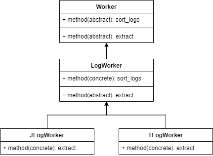
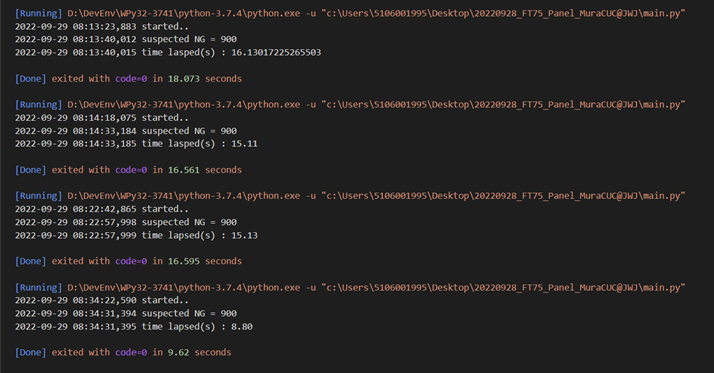

# How to sort Mura CUC Data Missing Panel

Recently, T-Con board data missing occurred at WW TV plants.

To determine the risk range out of 68,566 pcs, it is impossible for human operation in this case.

Therefore, this small application is built.

## Author
- 20220928 @ZL, SSVE TVQA member

## Changelog
- v0.01: initial build
- v0.02: bugfix

## Design pattern



## Project structure

```cmd
C:.
│  main.py
│  
├─data
│      20120920_12494300.csv
│      
├─doc
│  │  index.html
│  │  LogWorker.md
│  │  
│  └─static
│          demo.drawio.png
│          performance.png
│          
├─lib
│  │  config.py
│  │  jlogger.py
│  │  tlogger.py
│  │  util.py
│  │  __init__.py  
│  └─__pycache__
│          
└─test
        ut.py

```

## Implementation

```Python

class Worker(metaclass=ABCMeta):
    @abstractmethod
    def sort_logs(self, src_folder:Path, file_ext:str, dst_file:Path) -> None:
        raise NotImplementedError()

    @abstractmethod
    def extract(self, src_file:Path, dst:io.TextIOWrapper) -> int:
        raise NotImplementedError()

```

## Performance

算法(アルゴリズム)を最適化しましたので、

68,565枚サンプルの確認時間は16秒から8秒まで減りました。



## About

MIT License

Copyright (c) 2022 ZL

Permission is hereby granted, free of charge, to any person obtaining a copy
of this software and associated documentation files (the "Software"), to deal
in the Software without restriction, including without limitation the rights
to use, copy, modify, merge, publish, distribute, sublicense, and/or sell
copies of the Software, and to permit persons to whom the Software is
furnished to do so, subject to the following conditions:

The above copyright notice and this permission notice shall be included in all
copies or substantial portions of the Software.

THE SOFTWARE IS PROVIDED "AS IS", WITHOUT WARRANTY OF ANY KIND, EXPRESS OR
IMPLIED, INCLUDING BUT NOT LIMITED TO THE WARRANTIES OF MERCHANTABILITY,
FITNESS FOR A PARTICULAR PURPOSE AND NONINFRINGEMENT. IN NO EVENT SHALL THE
AUTHORS OR COPYRIGHT HOLDERS BE LIABLE FOR ANY CLAIM, DAMAGES OR OTHER
LIABILITY, WHETHER IN AN ACTION OF CONTRACT, TORT OR OTHERWISE, ARISING FROM,
OUT OF OR IN CONNECTION WITH THE SOFTWARE OR THE USE OR OTHER DEALINGS IN THE
SOFTWARE.
