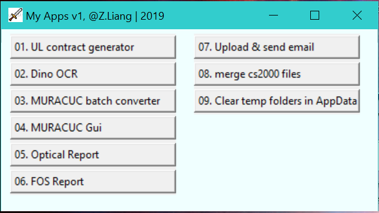
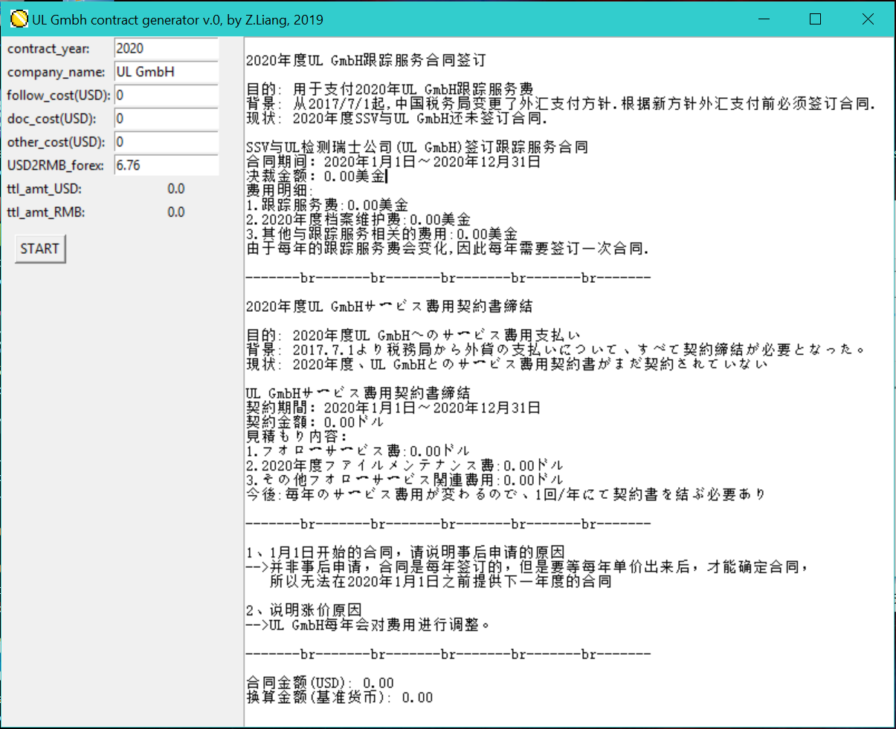
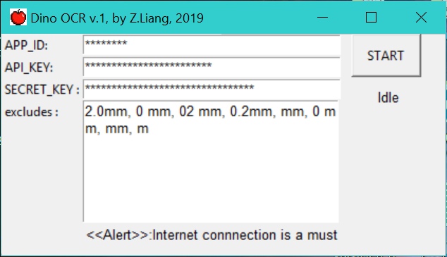
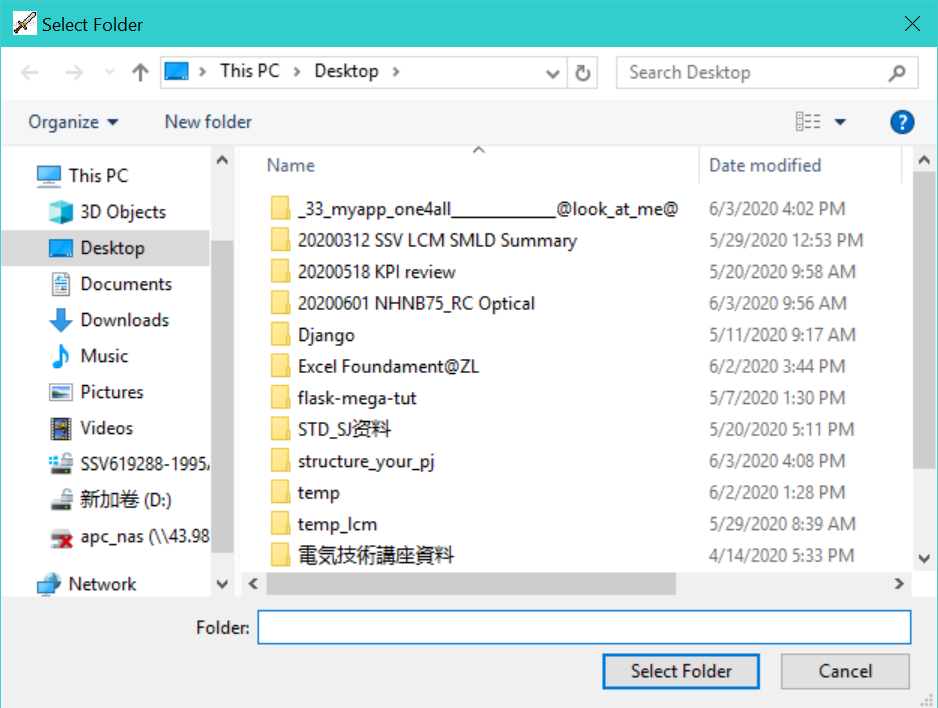
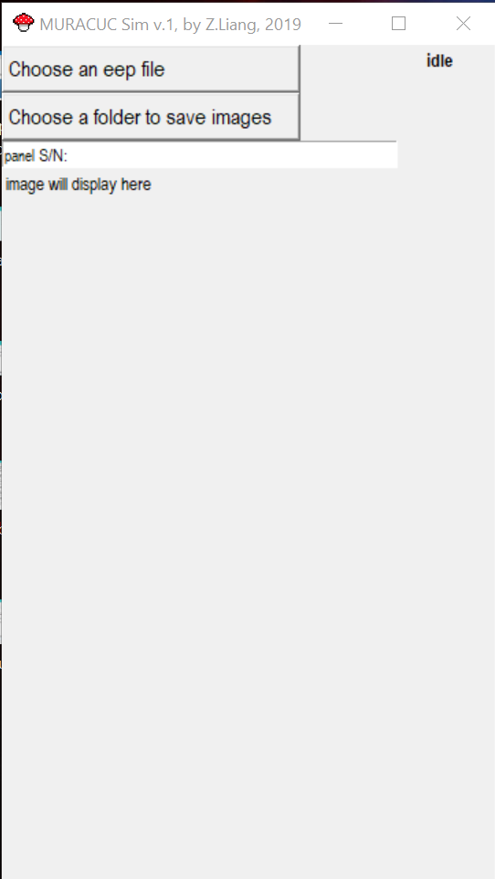
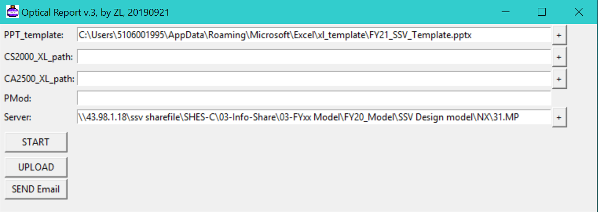
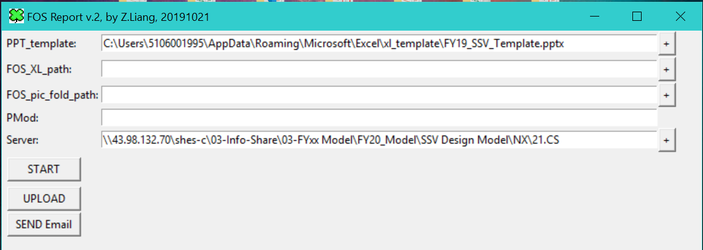
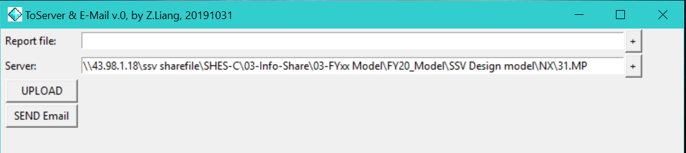
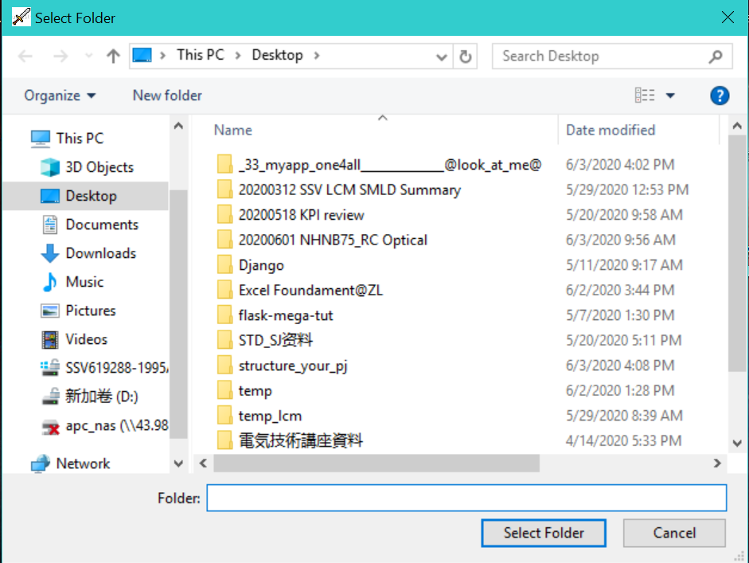

# Overview of one4all application
one4all application intends to facilitate productivity in ordinary route at SONY SH. <br>

## Application Functionality
It includes the following functions.
- converts *MURA/CUC* logs to images by ```batch```
- generates *UL GmbH* contract ```GUI```
- converts *MURA/CUC* log to image one by one with ```GUI```
- recognizes *Dino* measurement results and converts them and saves into ```.csv```
- creates optical reports(```.ppt```) based on *CS2000* and *CA2500* logs during Panel Optical R&D
- creates *FOS* reports(```.ppt```)
- uploads data and report to a specified server and sends notification via email
- merges cs2000 logs
- kills ```temp folders``` in ```AppData```

## Usage
Basically, they are user-friendly, right out of box to use.

- 
- 
- 
- 
- 
- 
- 
- 
- 


## Changelog
- v0, initiated and built
- v1, integrated and created GUI
- v2, refactored programs to make them extensible and flexible
- v3, restructured this application

## Disclaimer
This app is built by **ZL** to improve productivity in Panel R&D department.<br>
The scripts themselves are open source. You may use whatever you want.<br>
But ZL does <font color='red'>NOT</font> hold accountability for any data loss or damage.

## About
<!-- ZL is a senior engineer who have been working in *electronics* and *Optical* industry for years. <br>

As an engineer, not only am I familiar with tasks including <a>electronics and optical R&D</a>, <a>Prototype design</a>, <a>Production introduction</a>, <a>Total Quality Management</a>, <a>Market Technical Support</a> in <a>modern IoT framework</a>, <br>I also have accumulated comprehensive and foundametal knowladge in **computer science** as my second nature. <br>

I obtain sound experience in desktop application development using VB, Java, Python, C#, SQL and so on. <br>
Right now, ZL is still working actively in LCD panel, TV R&D field.<br>

Please contact me if you want any help or suggestion. -->
