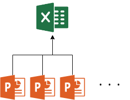

# Overview

Recently, SSVE internally requests Market team and QC team to provide a list of quality problems.

Market team normally is using PowerPoint to make reports(ie. 8D etc).

In this case, It's necessary to wrap up all information from PowerPoint files and list up.

# Diagram



# Thoughts

Before I get my hands dirty, I choose LBYL

## languages
It's straightforward and simple as the diagram above displays.

which lang is suitable for this?

**basic info**

- source files are pptx
- summary file is excel

**lang**

- VBA should be the first lang pops out.
- Python may work too via python-pptx pkg.

**merit**

- i don't wanna write a solution twice but different langs
- user environment may not use python. though it may convert .py -> .exe through pyinstaller

## psudo codes

```Python
def read_data_from_pptx(pptx_file_path):
    # open pptx file
    # find valid idpattern
    # read first page, store data into a data structure sequentially, like {pptx_page_title: [...]}
    # continue
    # stop till not valid idpattern found
    pass

def write_data_to_excel(stored_data, excel_file_path):
    # open excel file
    # write store_data into excel, each row per pptx page info
    pass
```

# Implementation

## Project structure

```vb
VB.pj
|
|-- Module1_pkg ' including basic functions and features
|
|-- Module2_main ' final procedure does job
|
|-- Module3_UI  ' a simple, user-friendly GUI 
|
|-- Module4_tests ' unittest
```

## Module1_pkg

This module contains basic functionalities to access, read and close PowerPoint files.

```vb
' Module1_pkg.bas

Public Sub pptx_reader(pptx_file_path As String, toWS As Worksheet)
    '''read data from pptx file and store into a worksheet @ZL, 202008'''
    Dim PPT As PowerPoint.Application: Set PPT = CreateObject("PowerPoint.Application")
    Dim p As Presentation: Set p = PPT.Presentations.Open(Filename:=pptx_file_path, ReadOnly:=True, WithWindow:=msoFalse)
    Dim s As Slide
    Dim sh As PowerPoint.Shape
    Dim tbl As PowerPoint.Table
    Dim start_slide_no As Integer: start_slide_no = 2
    Dim end_slide_no As Integer: end_slide_no = p.Slides.Count
    Dim slide_no As Integer
    Dim i As Integer, j As Integer, k As Integer, r As Integer, c As Integer
    Dim titleLen As Integer, tblRows As Integer
    Dim titleFlag As Boolean
    titleLen = 3
    titleFlag = False
    Dim tmpCell As Range
    Dim lastRow As Integer: lastRow = GetLastRow(toWS, 2) + 1
    
    ' read data and write into *toWS* in append mode
    On Error Resume Next
    For slide_no = start_slide_no To end_slide_no
        Set s = p.Slides(slide_no)
        Set tmpCell = toWS.Cells(lastRow, 2)
        With s.Shapes
            For i = 1 To .Count
                ' title
                If .Item(i).HasTextFrame And (Not titleFlag) Then
                    If (.Item(i).TextFrame.HasText) And (Len(.Item(i).TextFrame.TextRange.Text) > titleLen) Then
                        titleFlag = True
                        tmpCell.Value = .Item(i).TextFrame.TextRange.Text  'store title
                    End If
                End If
                ' table content
                If .Item(i).HasTable Then
                        Set tbl = .Item(i).Table
                        tblRows = tbl.Rows.Count
                        Select Case tblRows
                            ' table 01, rows = 8
                            Case Is = 8:
                                With tbl
                                    ' store table data into excel
                                    tmpCell.Offset(, 1).Value = .Cell(2, 1).Shape.TextFrame.TextRange.Text ' Problem Details£¨²»Á¼Ö¢×´£©
                                    tmpCell.Offset(, 2).Value = CStr(.Cell(2, 5).Shape.TextFrame.TextRange.Text) ' Red paper NO.
                                    tmpCell.Offset(, 3).Value = .Cell(4, 1).Shape.TextFrame.TextRange.Text ' problem Detail
                                    tmpCell.Offset(, 4).Value = .Cell(4, 5).Shape.TextFrame.TextRange.Text ' Occurred  Date
                                    tmpCell.Offset(, 5).Value = .Cell(4, 6).Shape.TextFrame.TextRange.Text ' Quantity
                                    tmpCell.Offset(, 6).Value = .Cell(6, 1).Shape.TextFrame.TextRange.Text ' Customer Status
                                    tmpCell.Offset(, 7).Value = .Cell(6, 6).Shape.TextFrame.TextRange.Text '    Parts
                                    tmpCell.Offset(, 8).Value = .Cell(8, 2).Shape.TextFrame.TextRange.Text ' Model
                                    tmpCell.Offset(, 9).Value = CStr(.Cell(8, 1).Shape.TextFrame.TextRange.Text) ' S/N  NO
                                    tmpCell.Offset(, 10).Value = .Cell(8, 3).Shape.TextFrame.TextRange.Text '  SSV line
                                    tmpCell.Offset(, 11).Value = .Cell(8, 4).Shape.TextFrame.TextRange.Text '  shift
                                    tmpCell.Offset(, 12).Value = .Cell(8, 5).Shape.TextFrame.TextRange.Text ' Found Plant
                                End With
                            ' table 02
                            Case Is = 6:
                                With tbl
                                    tmpCell.Offset(, 13).Value = .Cell(3, 2).Shape.TextFrame.TextRange.Text ' Define the problem£¨¶¨ÒåÎÊÌ⣩
                                    tmpCell.Offset(, 14).Value = .Cell(4, 2).Shape.TextFrame.TextRange.Text ' Define & verify root cause£¨ÕæÒò£©
                                    tmpCell.Offset(, 15).Value = .Cell(5, 2).Shape.TextFrame.TextRange.Text ' Short-term corrective action£¨•º¶¨Œ²ß£©
                                    tmpCell.Offset(, 16).Value = .Cell(6, 2).Shape.TextFrame.TextRange.Text ' Permanent Corrective Action£¨ºã¾ÃŒ²ß£©
                                    'tmpCell.Offset(, 17).Value = .Cell(2, 1).Shape.TextFrame.TextRange.Text ' Pictures£¨Ð´Õ棩
                                End With
                            Case Else:
                        End Select
                End If
            Next i
        End With
        lastRow = GetLastRow(toWS, 2) + 1
        titleFlag = False
    Next slide_no
    PPT.Quit
    Set PPT = Nothing
End Sub

```

## Module2_main

This module encapsulates all operation into one.

```vb
'Module2_main.bas

Public Sub start(Optional x As Integer = 1)
    ' setup writeIntoWS
    Dim TWB As Workbook: Set TWB = ThisWorkbook
    Dim ws_FY20Market As Worksheet: Set ws_FY20Market = TWB.Worksheets("FY20 市场")
    ' get relative source folder path
    Dim src_folder_path As String: src_folder_path = Module1_pkg.strFormat("{0}{1}{2}", TWB.path, Application.PathSeparator, "PPT文件")
    If Not Module1_pkg.FolderExists(src_folder_path) Then
        MsgBox "Error: 文件夹(PPT\市场) FolderNotFound", vbOKOnly, "FolderNotFoundError"
        Exit Sub
    End If
    Dim FSO As New FileSystemObject
    Dim src_folder As Folder: Set src_folder = FSO.GetFolder(src_folder_path)
    Dim f As File
    ' iterate through files inside the source folder, read pptx file and write into *ws_FY20Market*
    For Each f In src_folder.Files
        If Module1_pkg.is_pptx(f.path) Then Call Module1_pkg.pptx_reader(f.path, ws_FY20Market)
    Next f
End Sub　

Public Sub clear_history(Optional x As Integer = 1)
    ' setup writeIntoWS
    Dim TWB As Workbook: Set TWB = ThisWorkbook
    Dim ws_FY20Market As Worksheet: Set ws_FY20Market = TWB.Worksheets("FY20 市场")
    Dim startCol As Integer: startCol = 2
    Dim startRow As Integer: startRow = 3
    Dim lastRow As Integer: lastRow = Module1_pkg.GetLastRow(ws_FY20Market, startCol)
    Dim lastCol As Integer: lastCol = 18
    If lastRow >= startRow Then
        With ws_FY20Market
            .Range(.Cells(startRow, startCol), .Cells(lastRow, lastCol)).ClearContents
        End With
    End If
End Sub

```

# About

Copyright &copy; 2020 ZL

All rights reserved.

The MIT License (MIT)

Permission is hereby granted, free of charge, to any person obtaining a copy
of this software and associated documentation files (the "Software"), to deal
in the Software without restriction, including without limitation the rights
to use, copy, modify, merge, publish, distribute, sublicense, and/or sell
copies of the Software, and to permit persons to whom the Software is
furnished to do so, subject to the following conditions:

The above copyright notice and this permission notice shall be included in all
copies or substantial portions of the Software.

THE SOFTWARE IS PROVIDED "AS IS", WITHOUT WARRANTY OF ANY KIND, EXPRESS OR
IMPLIED, INCLUDING BUT NOT LIMITED TO THE WARRANTIES OF MERCHANTABILITY,
FITNESS FOR A PARTICULAR PURPOSE AND NONINFRINGEMENT. IN NO EVENT SHALL THE
AUTHORS OR COPYRIGHT HOLDERS BE LIABLE FOR ANY CLAIM, DAMAGES OR OTHER
LIABILITY, WHETHER IN AN ACTION OF CONTRACT, TORT OR OTHERWISE, ARISING FROM,
OUT OF OR IN CONNECTION WITH THE SOFTWARE OR THE USE OR OTHER DEALINGS IN THE
SOFTWARE.
