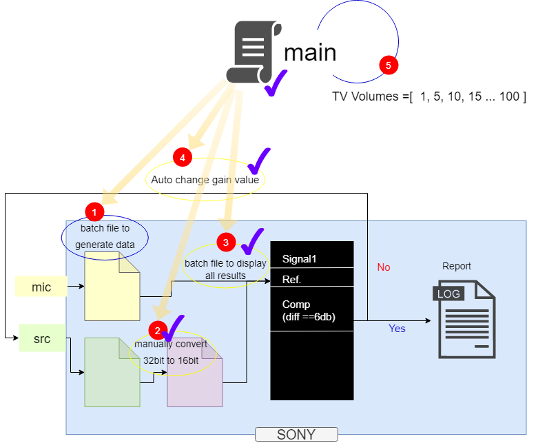

# Overview

There is a test/measurement for TV Remote Field Sound, which requires precise and time-consuming work to find results.

Goal here is to automate this test / measurement to get accurate result and decrease labor time.

We had explored SOX documentation to get details of each sox command for this automation.

[SoX - Sound eXhange | Documentation](http://sox.sourceforge.net/Docs/Documentation)

## Thoughts

- Discuss with Producation Design team to achieve **insights** of this test / measurement.
- Draw a **schema** to optimize and arrange work per step.
- Build **modules** for each work, then debug and test.
- Create a **main** module to combine sub modules, test and run.

## Schema

## Confirmation

To make this project maintainable and sustainable, some confirmation as follows.

* Create a module to run **batch** files. `Python builtin package: subprocess, os`
* Build a moulde to **convert bytes** data from 32bit to 16bit. `Python builtin package: array, numpy`
* Create a module to log **sox stats** of test .wav files. `Python builtin package: subprocess`
* Build a module to **extract data** from log file. `Python builtin File I/O`

## Project layout

    +---py_SOX_pkg
        |   core.py
        |   layout.md
        |   layout.txt
        |   main.py
        |   requirements.txt
        |   
        +---data
        |   |   sox_mic_src_stats
        |   |   
        |   +---output
        |   |       aec_loopback_post.bin
        |   |       sox_stats_diff
        |   |       
        |   +---已转
        |   |       aec_loopback_post.bin
        |   |       
        |   \---未转
        +---docs
        |   |   mkdocs.yml
        |   |   
        |   \---docs
        |           about.md
        |           index.md
        |          
        +---pkg
        |       converter.py
        |       parser.py
        |       runbat.py
        |       stats.py
        |       __init__.py
        |       
        \---tests
                M5_MicAuto_SRC_Adjust8.py
                test_convert_bin_file.py
                test_fmt.py
                test_get_stats_diff.py
                test_hash.py
                test_log.py
                test_sox_stat_da.py