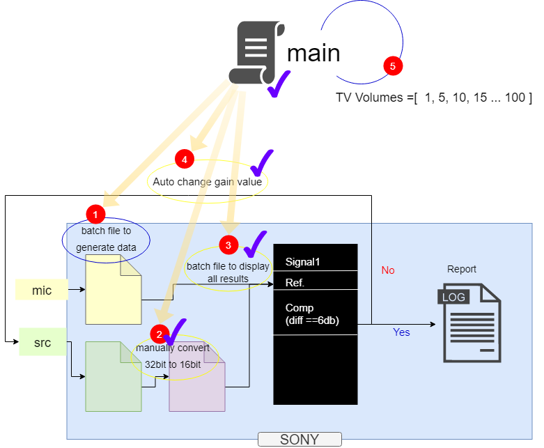
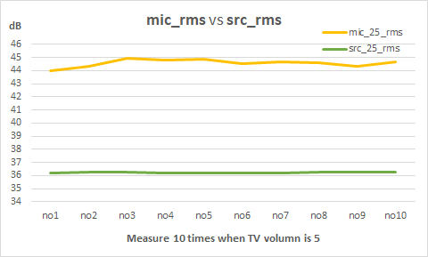

# Overview

There is a test/measurement for TV Remote Field Sound, which requires precise and time-consuming work to find results.

Goal here is to automate this test / measurement to get accurate result and decrease labor time.

We had explored SOX documentation to get details of each sox command for this automation.

[SoX - Sound eXhange | Documentation](http://sox.sourceforge.net/Docs/Documentation)

## Changelog

- v0.0.1, inital version
- v0.0.2, fix bugs
- v0.0.3, algorithm
- v0.0.4, fix bugs
  
## Performance

Here is performance comparison between manual operation and this program.

- previous worktime to get results by manual operation<br>it took **2 workdays**
- current worktime using this program<br>it takes **22mins**

    

# TV Remote Field Sound Auto Project

The following sections are the details of this projects from design to implementation.

## Thoughts

- Discuss with Producation Design team to achieve **insights** of this test / measurement.
- Draw a **schema** to optimize and arrange work per step.
- Build **modules** for each work, then debug and test.
- Create a **main** module to combine sub modules, test and run.

## Schema



## Confirmation

To make this project maintainable and sustainable, some confirmation as follows.

- Create a module to **run batch** files. `Python builtin package: subprocess, os`
- Build a moulde to **convert bytes** data from 32bit to 16bit bytes. `Python builtin package: array, numpy`
- Create a module to log **sox stats** of test .wav files. `Python builtin package: subprocess`
- Build a module to **extract data** from log file. `Python builtin File I/O`

## Project layout

    +---py_SOX_pkg
        |   main.py
        |   multiple10.py
        |   readme.html
        |   readme.md
        |   readme.pdf
        |   single.py
        |   tree.txt
        |   
        +---data
        |   |   sox_mic_src_stats
        |   |   
        |   +---output
        |   |       aec_loopback_post.bin
        |   |       sox_stats_diff
        |   |       
        |   +---已转
        |   |       aec_loopback_post.bin
        |   |       
        |   \---未转
        |       |   aec_loopback_post.bin
        |       |   
        |       \---bin
        |               aec_loopback_post.bin
        |               
        +---docs
        |   |   mkdocs.yml
        |   |   
        |   \---docs
        |       |   about.md
        |       |   algorithm.md
        |       |   detail.md
        |       |   index.md
        |       |   
        |       \---static
        |               IDEL_LOG.png
        |               log.txt
        |               mic_rms_src_rms.png
        |               mic_rms_variant.png
        |               performance.jpg
        |               schema.png
        |               
        +---lib
        |   |   core.py
        |   |   
        |   +---pkg
        |   |       converter.py
        |   |       gain.dll
        |   |       gain.py
        |   |       parser.py
        |   |       runbat.py
        |   |       stats.py
        |   |       __init__.py
        |   |       
        |   \---util
        |           hashes.py
        |           
        \---tests
            |   Ref_M5_MicAuto_SRC_Adjust8.py
            |   test_converter.py
            |   test_gain.py
            |   test_parser.py
            |   test_runbat.py
            |   
            \---bats
                    STEP1 create_files.cmd
                    STEP2 rename_files.cmd
                    STEP3 delete_files.cmd

# Implementations

This page covers most of details of this project.

## Batch Runner

Build a common module to run batch files.

```Python
#runbat.py
import subprocess

def change_src_gain(gain_value):
    """Author: SHES

    :param gain_value: gain value
    :type gain_value: float
    """
    subprocess.call("adb root", shell=True)
    subprocess.call("adb shell setenforce 0", shell=True)
    subprocess.call("adb shell chmod 777 data", shell=True)
    subprocess.call("adb shell setprop vendor.mtk.audio.aec.ref.gain {}".format(gain_value), shell=True)

def run_batch(batch_file):
    """wrapper to run batch file

    :param batch_file: name or path of batch file
    :type batch_file: string
    """
    proc = subprocess.Popen(batch_file, shell=True)
    proc.wait()
```

## Bit Converter

Build a module to convert bytes data from 32bit to 16bit

```Python
#converter.py
import array, os

_TYP = 'B' #found during data exploration inside of source .bin files, bytes data

def get_bin_len_of_file(src_file):
    """Open a binary file and calculate the length of it.

    :param src_file: name or path of a binary file
    :type src_file: string
    """
    import numpy as np
    with open(src_file, 'rb') as f:
        tmp_arr = np.fromfile(f)
    return len(tmp_arr)

def read_src_file(src_file):
    """Read a binary file, and return as array.array()

    :param src: file name or path of the binary file
    :type src: string
    """
    num_lon = 8 #found during data exploration inside of source .bin files, bytes data
    num_lat = get_bin_len_of_file(src_file)
    with open(src_file, 'rb') as f:
        tmp_arr = array.array(_TYP)
        tmp_arr.fromfile(f, num_lon*num_lat)
    return tmp_arr

def extract_16_from_32(arr):
    """Extract 16bit data from 32bit array

    :param arr: an array of 32bit bytes
    :type arr: list

                            0    1    2    3    4    5    6    7
    >>> extract_16_from_32(0100 1000 0001 0001 0101 1001 0101 0101)
        0     2     4     6
    >>> [0100, 0001, 0101, 0101]
    """
    start = 0
    stop = len(arr)
    step = 4
    tmp_list = []
    for i in range(start, stop, step):
        tmp_list.extend(arr[i:i+2])
    return tmp_list

def save_bytes_to_file(seq, new_file):
    """convert list to array.array() then save as a binary file

    :param seq: a list of bytes
    :type seq: list
    """
    with open(new_file, 'wb') as f:
        tmp_arr = array.array(_TYP)
        tmp_arr.fromlist(seq)
        tmp_arr.tofile(f)
    return

def convert_32bit_to_16bit2(src_file, new_file):
    """
    Author: @SHES
    """
    index = 0
    with open(src_file, 'rb') as sf, open(new_file, 'wb') as nf:
        while True:
            buf = sf.read(2)
            if not buf:
                break
            if(index % 2 == 0):
                nf.write(buf)
            index += 1
    os.remove(src_file)
    file_name = "aec_loopback_post.bin"
    os.rename(new_file, os.path.join(os.path.split(new_file)[0], file_name))
    return

def convert_32bit_to_16bit(src_file, new_file):
    """Convert a binary file that is 32bit to 16bit

    :param src_file: file name or path of a source binary file
    :type src_file: string
    :param new_file: file name or path of a new binary file
    :type new_file: string
    """
    # read a source file as binary
    array_32bit = read_src_file(src_file)
    # extract
    list_16bit = extract_16_from_32(array_32bit)
    # encode combined data, then write into a binary file
    save_bytes_to_file(list_16bit, new_file)
    print('Done')
    return
```

## SoX Log

Build a module to log output of `sox sample.wav -n stats`

```Python
#stats.py
import subprocess, os

def get_wav_stats(wav_file):
    """get output of sox -n stats for a single .wav file and return the output log 

    :param wav_file: name or path of .wav file
    :type wav_file: bytes
    """
    rough_wav_stat = subprocess.check_output("sox {0} -n stats".format(wav_file),
                                            stderr=subprocess.STDOUT,
                                            shell=True)
    return rough_wav_stat

def save_wav_stats_to_txt(bytes_data, new_file):
    """convert bytes data into string, and save it into text file

    :param bytes_data: bytes data from a stream
    :type bytes_data: bytes
    :param new_file: path or name of a text file
    :type new_file: string
    """
    sox_stats = bytes_data.decode("utf-8")
    with open(new_file, "a") as f:
        f.writelines(sox_stats)
    return

def get_sox_stats(wav_file_mic25, wav_file_src25, log_file):
    """wrapper to generate sox stats and save to local disk
    """
    # put .wav files into a list container
    wav_files = [
        wav_file_mic25,
        wav_file_src25
        ]
    # remove history record, because pkg.stats modules write data in append mode
    if os.path.exists(log_file):
        os.remove(log_file)
    # write new stats into the text file
    for file in wav_files:
        tmp_wav_stats = get_wav_stats(file)
        save_wav_stats_to_txt(tmp_wav_stats, log_file)
    return
```

## Log Parser

Build a module to parse SoX log and return data.

```Python
#parser.py

def get_data_from_sox_stats_txt(src_file):
    """read sox_mic_src_stats.txt and return rows starts with ("Pk lev dB", "RMS lev dB")

    :param src_file: path or name of a sox_mic_src_stats.txt file
    :type src_file: string
    """
    PklevdB_header = "Pk lev dB"
    RMSlevdB_header = "RMS lev dB"
    with open(src_file, 'r') as f:
        tmp_data = [line for line in f.readlines() if line.startswith(PklevdB_header) or line.startswith(RMSlevdB_header)]
    return tmp_data

def parse_PklevdB_and_RMSlevdB(seq):
    """parse strings inside seq and return overall values which are float type 

    :param seq: a list of strings
    :type seq: list

    >>> parse_RMSlevdB(["Pk lev dB     -26.79    -27.14    -26.79\n", "Pk lev dB     -25.34    -25.34    -25.34\n"])
    >>> [-26.79, '-25.34']
    >>> parse_RMSlevdB(["RMS lev dB    -40.72    -42.04    -39.70\n","RMS lev dB    -35.05    -35.05    -35.05\n"])
    >>> [-40.72, -35.05]
    """
    tmp_seq = []
    index_cmn_val = 3
    #remove '' inside seq
    for item in seq:
        tmp_arr = item.strip().split(" ")
        tmp_seq.append([s for s in tmp_arr if s != ''])
    return [float(tmp_item[index_cmn_val]) for tmp_item in tmp_seq]

def get_diff(seq):
    """return difference between src_25.wav and mic_25.wav, diff = (src_25.wav - mic_25.wav)

    :param seq: a list of two floats, first is mic_25.wav("RMS lev dB", "Overall"), second is src_25.wav("RMS lev dB", "Overall")
    :type seq: list
    :return: difference
    :rtype: float
    """
    return round((seq[3] - seq[1]), 2)

def get_src_Pklev(seq):
    """return Pk lev dB of src_25.wav

    :param seq: a list of Pk, RMS values
    :type seq: list
    :return: Pk lev dB of src_25.wav
    :rtype: float
    """
    return float(seq[2])

def read_sox_stats_and_get_diff_Pklev(src_file):
    """wrapper to return diff between mic_25.wav and src_25.wav

    :param src_file: path or name of a sox_mic_src_stats.txt file
    :type src_file: string
    :return: difference(mic_25.wav - src_25.wav) and src Pk lev dB
    :rtype: tuple
    """
    seq = get_data_from_sox_stats_txt(src_file)
    lst = parse_PklevdB_and_RMSlevdB(seq)
    return get_diff(lst), get_src_Pklev(lst)
```

# Overview of algorithm

It is a bit challenge to find an appropriate algorithm to calculate.

But we finally made it.

## Basic Info

- specification is `abs(mic_rms - src_rms) = 6.0±0.1`. The magic number is from SHES
- `mic_rms_val` fluctrates. It is sensitive and susceptible to surrounding noise
- `src_rms_val` is TV sound value(dB), it enumerates every volumes [1,2,..,100]

It is seemingly simple to find out an algorithm as follows.  Though it is not the case, due to `mic_rms_val` drastic variantion, 
```
6.0 - 0.1 <= |mic_rms_val - src_rms_val| <= 6.0 + 0.1
```

## Investigation

We had run several experimental tests to gather first-hand raw data of `mic_rms_val` and `src_rms_val`.

The following graph displays their variation during continual 6mins when **TV volume is 5**.

- `mic_rms_val` variates dramatically due to ambient noise outside of the lab room.

- `src_rms_val`(or `Reference`) is stable. Its max variation is 0.01. It has little effection compared with tolerance of specification(±0.1).




The raw data as follows.

```
2020-07-06 13:29:53 Diff, src_25_Pk, [mic_25_Pk, mic_25_RMS, src_25_Pk, src_25_RMS]
2020-07-06 13:29:53 (7.76, 26.99, [33.81, 44.01, 26.99, 36.25])
2020-07-06 13:30:31 Diff, src_25_Pk, [mic_25_Pk, mic_25_RMS, src_25_Pk, src_25_RMS]
2020-07-06 13:30:31 (8.06, 26.15, [33.81, 44.32, 26.15, 36.26])
2020-07-06 13:31:12 Diff, src_25_Pk, [mic_25_Pk, mic_25_RMS, src_25_Pk, src_25_RMS]
2020-07-06 13:31:12 (8.7, 26.42, [34.52, 44.96, 26.42, 36.26])
2020-07-06 13:31:52 Diff, src_25_Pk, [mic_25_Pk, mic_25_RMS, src_25_Pk, src_25_RMS]
2020-07-06 13:31:52 (8.57, 26.33, [34.48, 44.82, 26.33, 36.25])
2020-07-06 13:32:33 Diff, src_25_Pk, [mic_25_Pk, mic_25_RMS, src_25_Pk, src_25_RMS]
2020-07-06 13:32:33 (8.61, 26.75, [34.73, 44.86, 26.75, 36.25])
2020-07-06 13:33:19 Diff, src_25_Pk, [mic_25_Pk, mic_25_RMS, src_25_Pk, src_25_RMS]
2020-07-06 13:33:19 (8.29, 26.54, [34.82, 44.54, 26.54, 36.25])
2020-07-06 13:33:58 Diff, src_25_Pk, [mic_25_Pk, mic_25_RMS, src_25_Pk, src_25_RMS]
2020-07-06 13:33:58 (8.43, 26.15, [34.42, 44.68, 26.15, 36.25])
2020-07-06 13:34:34 Diff, src_25_Pk, [mic_25_Pk, mic_25_RMS, src_25_Pk, src_25_RMS]
2020-07-06 13:34:34 (8.32, 26.16, [34.34, 44.58, 26.16, 36.26])
2020-07-06 13:35:13 Diff, src_25_Pk, [mic_25_Pk, mic_25_RMS, src_25_Pk, src_25_RMS]
2020-07-06 13:35:13 (8.07, 26.54, [34.16, 44.33, 26.54, 36.26])
2020-07-06 13:35:51 Diff, src_25_Pk, [mic_25_Pk, mic_25_RMS, src_25_Pk, src_25_RMS]
2020-07-06 13:35:51 (8.4, 26.45, [33.88, 44.66, 26.45, 36.26])
```

## Algorithm

Main program will try `N` times to search the best `src_rms_val`.

Even after `N` time tries, there is no available number found, then it implements `harmonic mean` to get a number that is close enough to true value.


```
Harmonic Mean = n / ∑ [1/Xi]
```

## Verification

We started the Main program to find suitabl `src_rms_val` when TV volume is 1, 5, 10, 15, 20, 25, 30 ...

Low TV volume tests are most significantly prone to take long time to find out suitable numbers.

Average search time is 66.60 seconds.

<font color="blue">**It predicts total search time of TV Remote Sound test is 20 minutes.**</font>

| volume  | Search time(s)  |
|---|---|
|  1 |  99.11 |
|  5 |  33.14 |
|  10 | 164.44  |
|  15 | 65.89  |
|  20 | 65.43  |
|  25 | 65.72  |
|  30 | 76.41  |
|  35 | 66.60  |
|  40 | 66.60  |
|  45 | 66.60  |
|  50 | 66.60  |
|  55 | 66.60  |
|  60 | 66.60  |
|  70 | 66.60  |
|  80 | 66.60  |
|  90 | 66.60  |
|  100 |66.60   |

Here is output.


And here is raw data of output.

```python
Python 3.7.4 (tags/v3.7.4:e09359112e, Jul  8 2019, 20:34:20) [MSC v.1916 64 bit (AMD64)] on win32
Type "help", "copyright", "credits" or "license()" for more information.
>>>
======== RESTART: C:\Users\ssv\Desktop\_99_py_SOX_pkg_v0.0.3\main.py ========
init meas   : 2020-07-07 08:50:05,Diff=5.53,mic_RMS=40.59,src_RMS=35.06,Gain_val=0.00
before gain : 2020-07-07 08:50:05,Diff=5.53,mic_RMS=40.59,src_RMS=35.06,Gain_val=0.47
after gain  : 2020-07-07 08:50:38,Diff=7.25,mic_RMS=41.84,src_RMS=34.59,Gain_val=0.47
before gain : 2020-07-07 08:50:38,Diff=7.25,mic_RMS=41.84,src_RMS=34.59,Gain_val=-0.78
after gain  : 2020-07-07 08:51:11,Diff=5.95,mic_RMS=41.79,src_RMS=35.84,Gain_val=-0.78
Finished. Runtime is 99.11s
Result: [(-0.78, [29.35, 41.79, 26.37, 35.84])]
>>>
======== RESTART: C:\Users\ssv\Desktop\_99_py_SOX_pkg_v0.0.3\main.py ========
init meas   : 2020-07-07 08:53:17,Diff=6.09,mic_RMS=42.35,src_RMS=36.26,Gain_val=0.00
Finished. Runtime is 33.14s
Result: [(0, [26.02, 42.35, 26.54, 36.26])]
>>>
======== RESTART: C:\Users\ssv\Desktop\_99_py_SOX_pkg_v0.0.3\main.py ========
init meas   : 2020-07-07 08:54:23,Diff=8.39,mic_RMS=45.05,src_RMS=36.66,Gain_val=0.00
before gain : 2020-07-07 08:54:23,Diff=8.39,mic_RMS=45.05,src_RMS=36.66,Gain_val=-2.39
after gain  : 2020-07-07 08:54:56,Diff=5.45,mic_RMS=44.50,src_RMS=39.05,Gain_val=-2.39
before gain : 2020-07-07 08:54:56,Diff=5.45,mic_RMS=44.50,src_RMS=39.05,Gain_val=-1.84
after gain  : 2020-07-07 08:55:29,Diff=7.05,mic_RMS=45.55,src_RMS=38.50,Gain_val=-1.84
before gain : 2020-07-07 08:55:29,Diff=7.05,mic_RMS=45.55,src_RMS=38.50,Gain_val=-2.89
after gain  : 2020-07-07 08:56:02,Diff=5.51,mic_RMS=45.06,src_RMS=39.55,Gain_val=-2.89
Finished. Runtime is 164.44s
Result: [(-2.38, [36.26, 45.04, 28.98, 39.04])]
>>>
======== RESTART: C:\Users\ssv\Desktop\_99_py_SOX_pkg_v0.0.3\main.py ========
init meas   : 2020-07-07 08:58:42,Diff=6.57,mic_RMS=37.43,src_RMS=30.86,Gain_val=0.00
before gain : 2020-07-07 08:58:42,Diff=6.57,mic_RMS=37.43,src_RMS=30.86,Gain_val=-0.57
after gain  : 2020-07-07 08:59:15,Diff=5.98,mic_RMS=37.40,src_RMS=31.42,Gain_val=-0.57
Finished. Runtime is 65.89s
Result: [(-0.57, [24.63, 37.4, 21.57, 31.42])]
>>>
======== RESTART: C:\Users\ssv\Desktop\_99_py_SOX_pkg_v0.0.3\main.py ========
init meas   : 2020-07-07 09:00:16,Diff=5.82,mic_RMS=33.47,src_RMS=27.65,Gain_val=0.00
before gain : 2020-07-07 09:00:16,Diff=5.82,mic_RMS=33.47,src_RMS=27.65,Gain_val=0.18
after gain  : 2020-07-07 09:00:49,Diff=5.91,mic_RMS=33.38,src_RMS=27.47,Gain_val=0.18
Finished. Runtime is 65.43s
Result: [(0.18, [19.74, 33.38, 17.7, 27.47])]
>>>
======== RESTART: C:\Users\ssv\Desktop\_99_py_SOX_pkg_v0.0.3\main.py ========
init meas   : 2020-07-07 09:01:48,Diff=5.66,mic_RMS=30.21,src_RMS=24.55,Gain_val=0.00
before gain : 2020-07-07 09:01:48,Diff=5.66,mic_RMS=30.21,src_RMS=24.55,Gain_val=0.34
after gain  : 2020-07-07 09:02:21,Diff=5.95,mic_RMS=30.16,src_RMS=24.21,Gain_val=0.34
Finished. Runtime is 65.72s
Result: [(0.34, [16.49, 30.16, 14.76, 24.21])]
>>>
======== RESTART: C:\Users\ssv\Desktop\_99_py_SOX_pkg_v0.0.3\main.py ========
init meas   : 2020-07-07 09:03:37,Diff=5.50,mic_RMS=28.35,src_RMS=22.85,Gain_val=0.00
before gain : 2020-07-07 09:03:37,Diff=5.50,mic_RMS=28.35,src_RMS=22.85,Gain_val=0.50
after gain  : 2020-07-07 09:04:15,Diff=5.94,mic_RMS=28.29,src_RMS=22.35,Gain_val=0.50
Finished. Runtime is 76.41s
Result: [(0.5, [15.03, 28.29, 12.25, 22.35])]
>>>
```

# About

Copyright &copy; 2020 ZL

All rights reserved.

The MIT License (MIT)

Permission is hereby granted, free of charge, to any person obtaining a copy
of this software and associated documentation files (the "Software"), to deal
in the Software without restriction, including without limitation the rights
to use, copy, modify, merge, publish, distribute, sublicense, and/or sell
copies of the Software, and to permit persons to whom the Software is
furnished to do so, subject to the following conditions:

The above copyright notice and this permission notice shall be included in all
copies or substantial portions of the Software.

THE SOFTWARE IS PROVIDED "AS IS", WITHOUT WARRANTY OF ANY KIND, EXPRESS OR
IMPLIED, INCLUDING BUT NOT LIMITED TO THE WARRANTIES OF MERCHANTABILITY,
FITNESS FOR A PARTICULAR PURPOSE AND NONINFRINGEMENT. IN NO EVENT SHALL THE
AUTHORS OR COPYRIGHT HOLDERS BE LIABLE FOR ANY CLAIM, DAMAGES OR OTHER
LIABILITY, WHETHER IN AN ACTION OF CONTRACT, TORT OR OTHERWISE, ARISING FROM,
OUT OF OR IN CONNECTION WITH THE SOFTWARE OR THE USE OR OTHER DEALINGS IN THE
SOFTWARE.
