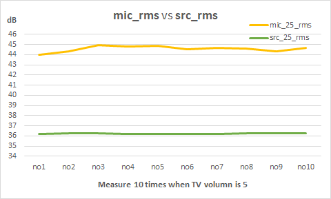
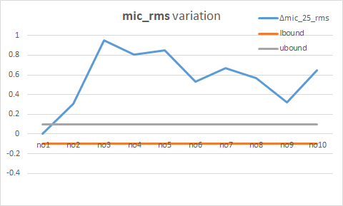
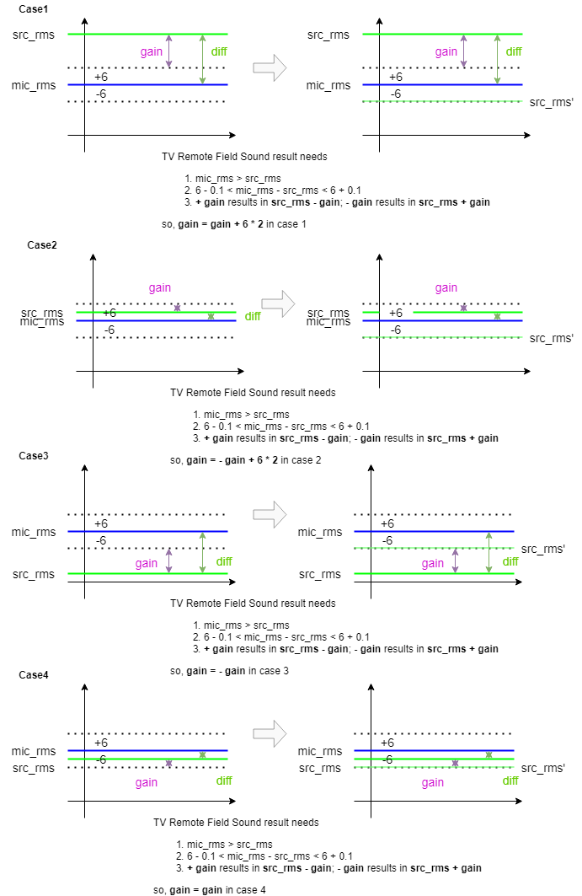
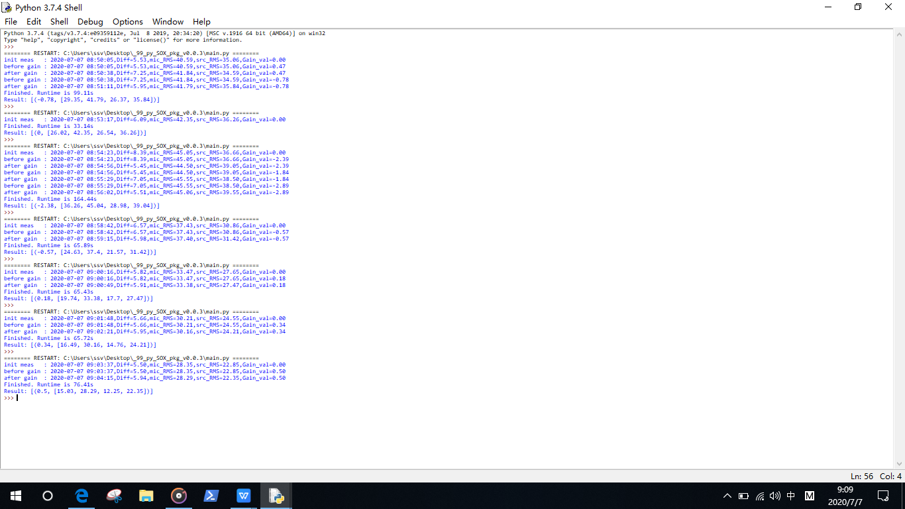

# Overview of this section

It is a bit challenge to find an appropriate algorithm to calculate.

But we finally make it.

## Basic Info

- specification is `abs(mic_rms - src_rms) = 6.0±0.1`. The magic number is from SHES
- `mic_rms_val` fluctrates. It is sensitive and susceptible to surrounding noise
- `src_rms_val` is TV sound value(dB), it enumerates every volumes [1,2,..,100]

It is seemingly simple to find out an algorithm as follows.  Though it is not the case, due to `mic_rms_val` drastic variantion, 
```
6.0 - 0.1 <= |mic_rms_val - src_rms_val| <= 6.0 + 0.1
```

## Investigation

We had run several experimental tests to gather first-hand raw data of `mic_rms_val` and `src_rms_val`.

The following graph displays their variation during continual 6mins when **TV volume is 5**.

- `mic_rms_val` variates dramatically due to ambient noise outside of the lab room.

- `src_rms_val`(or `Reference`) is stable. Its max variation is 0.01. It has little effection compared with tolerance of specification(±0.1).






The raw data as follows.

```
2020-07-06 13:29:53 Diff, src_25_Pk, [mic_25_Pk, mic_25_RMS, src_25_Pk, src_25_RMS]
2020-07-06 13:29:53 (7.76, 26.99, [33.81, 44.01, 26.99, 36.25])
2020-07-06 13:30:31 Diff, src_25_Pk, [mic_25_Pk, mic_25_RMS, src_25_Pk, src_25_RMS]
2020-07-06 13:30:31 (8.06, 26.15, [33.81, 44.32, 26.15, 36.26])
2020-07-06 13:31:12 Diff, src_25_Pk, [mic_25_Pk, mic_25_RMS, src_25_Pk, src_25_RMS]
2020-07-06 13:31:12 (8.7, 26.42, [34.52, 44.96, 26.42, 36.26])
2020-07-06 13:31:52 Diff, src_25_Pk, [mic_25_Pk, mic_25_RMS, src_25_Pk, src_25_RMS]
2020-07-06 13:31:52 (8.57, 26.33, [34.48, 44.82, 26.33, 36.25])
2020-07-06 13:32:33 Diff, src_25_Pk, [mic_25_Pk, mic_25_RMS, src_25_Pk, src_25_RMS]
2020-07-06 13:32:33 (8.61, 26.75, [34.73, 44.86, 26.75, 36.25])
2020-07-06 13:33:19 Diff, src_25_Pk, [mic_25_Pk, mic_25_RMS, src_25_Pk, src_25_RMS]
2020-07-06 13:33:19 (8.29, 26.54, [34.82, 44.54, 26.54, 36.25])
2020-07-06 13:33:58 Diff, src_25_Pk, [mic_25_Pk, mic_25_RMS, src_25_Pk, src_25_RMS]
2020-07-06 13:33:58 (8.43, 26.15, [34.42, 44.68, 26.15, 36.25])
2020-07-06 13:34:34 Diff, src_25_Pk, [mic_25_Pk, mic_25_RMS, src_25_Pk, src_25_RMS]
2020-07-06 13:34:34 (8.32, 26.16, [34.34, 44.58, 26.16, 36.26])
2020-07-06 13:35:13 Diff, src_25_Pk, [mic_25_Pk, mic_25_RMS, src_25_Pk, src_25_RMS]
2020-07-06 13:35:13 (8.07, 26.54, [34.16, 44.33, 26.54, 36.26])
2020-07-06 13:35:51 Diff, src_25_Pk, [mic_25_Pk, mic_25_RMS, src_25_Pk, src_25_RMS]
2020-07-06 13:35:51 (8.4, 26.45, [33.88, 44.66, 26.45, 36.26])
```

## Algorithm

Main program will try `N` times to search the best `src_rms_val`.

Even after `N` time tries, there is no available number found, then it implements `harmonic meas` to get a number that is close enough to true value.



```
Harmonic Mean = n / ∑ [1/Xi]
```

## Verification

We started the Main program to find suitabl `src_rms_val` when TV volume is 1, 5, 10, 15, 20, 25, 30 ...

Low TV volume tests are most significantly prone to take long time to find out suitable numbers.

Average search time is 66.60 seconds.

<font color="blue">**It predicts total search time of TV Remote Sound test is 20 minutes.**</font>

| volume  | Search time(s)  |
|---|---|
|  1 |  99.11 |
|  5 |  33.14 |
|  10 | 164.44  |
|  15 | 65.89  |
|  20 | 65.43  |
|  25 | 65.72  |
|  30 | 76.41  |
|  35 | 66.60  |
|  40 | 66.60  |
|  45 | 66.60  |
|  50 | 66.60  |
|  55 | 66.60  |
|  60 | 66.60  |
|  70 | 66.60  |
|  80 | 66.60  |
|  90 | 66.60  |
|  100 |66.60   |

Here is output.



And here is raw data of output.

```python
Python 3.7.4 (tags/v3.7.4:e09359112e, Jul  8 2019, 20:34:20) [MSC v.1916 64 bit (AMD64)] on win32
Type "help", "copyright", "credits" or "license()" for more information.
>>>
======== RESTART: C:\Users\ssv\Desktop\_99_py_SOX_pkg_v0.0.3\main.py ========
init meas   : 2020-07-07 08:50:05,Diff=5.53,mic_RMS=40.59,src_RMS=35.06,Gain_val=0.00
before gain : 2020-07-07 08:50:05,Diff=5.53,mic_RMS=40.59,src_RMS=35.06,Gain_val=0.47
after gain  : 2020-07-07 08:50:38,Diff=7.25,mic_RMS=41.84,src_RMS=34.59,Gain_val=0.47
before gain : 2020-07-07 08:50:38,Diff=7.25,mic_RMS=41.84,src_RMS=34.59,Gain_val=-0.78
after gain  : 2020-07-07 08:51:11,Diff=5.95,mic_RMS=41.79,src_RMS=35.84,Gain_val=-0.78
Finished. Runtime is 99.11s
Result: [(-0.78, [29.35, 41.79, 26.37, 35.84])]
>>>
======== RESTART: C:\Users\ssv\Desktop\_99_py_SOX_pkg_v0.0.3\main.py ========
init meas   : 2020-07-07 08:53:17,Diff=6.09,mic_RMS=42.35,src_RMS=36.26,Gain_val=0.00
Finished. Runtime is 33.14s
Result: [(0, [26.02, 42.35, 26.54, 36.26])]
>>>
======== RESTART: C:\Users\ssv\Desktop\_99_py_SOX_pkg_v0.0.3\main.py ========
init meas   : 2020-07-07 08:54:23,Diff=8.39,mic_RMS=45.05,src_RMS=36.66,Gain_val=0.00
before gain : 2020-07-07 08:54:23,Diff=8.39,mic_RMS=45.05,src_RMS=36.66,Gain_val=-2.39
after gain  : 2020-07-07 08:54:56,Diff=5.45,mic_RMS=44.50,src_RMS=39.05,Gain_val=-2.39
before gain : 2020-07-07 08:54:56,Diff=5.45,mic_RMS=44.50,src_RMS=39.05,Gain_val=-1.84
after gain  : 2020-07-07 08:55:29,Diff=7.05,mic_RMS=45.55,src_RMS=38.50,Gain_val=-1.84
before gain : 2020-07-07 08:55:29,Diff=7.05,mic_RMS=45.55,src_RMS=38.50,Gain_val=-2.89
after gain  : 2020-07-07 08:56:02,Diff=5.51,mic_RMS=45.06,src_RMS=39.55,Gain_val=-2.89
Finished. Runtime is 164.44s
Result: [(-2.38, [36.26, 45.04, 28.98, 39.04])]
>>>
======== RESTART: C:\Users\ssv\Desktop\_99_py_SOX_pkg_v0.0.3\main.py ========
init meas   : 2020-07-07 08:58:42,Diff=6.57,mic_RMS=37.43,src_RMS=30.86,Gain_val=0.00
before gain : 2020-07-07 08:58:42,Diff=6.57,mic_RMS=37.43,src_RMS=30.86,Gain_val=-0.57
after gain  : 2020-07-07 08:59:15,Diff=5.98,mic_RMS=37.40,src_RMS=31.42,Gain_val=-0.57
Finished. Runtime is 65.89s
Result: [(-0.57, [24.63, 37.4, 21.57, 31.42])]
>>>
======== RESTART: C:\Users\ssv\Desktop\_99_py_SOX_pkg_v0.0.3\main.py ========
init meas   : 2020-07-07 09:00:16,Diff=5.82,mic_RMS=33.47,src_RMS=27.65,Gain_val=0.00
before gain : 2020-07-07 09:00:16,Diff=5.82,mic_RMS=33.47,src_RMS=27.65,Gain_val=0.18
after gain  : 2020-07-07 09:00:49,Diff=5.91,mic_RMS=33.38,src_RMS=27.47,Gain_val=0.18
Finished. Runtime is 65.43s
Result: [(0.18, [19.74, 33.38, 17.7, 27.47])]
>>>
======== RESTART: C:\Users\ssv\Desktop\_99_py_SOX_pkg_v0.0.3\main.py ========
init meas   : 2020-07-07 09:01:48,Diff=5.66,mic_RMS=30.21,src_RMS=24.55,Gain_val=0.00
before gain : 2020-07-07 09:01:48,Diff=5.66,mic_RMS=30.21,src_RMS=24.55,Gain_val=0.34
after gain  : 2020-07-07 09:02:21,Diff=5.95,mic_RMS=30.16,src_RMS=24.21,Gain_val=0.34
Finished. Runtime is 65.72s
Result: [(0.34, [16.49, 30.16, 14.76, 24.21])]
>>>
======== RESTART: C:\Users\ssv\Desktop\_99_py_SOX_pkg_v0.0.3\main.py ========
init meas   : 2020-07-07 09:03:37,Diff=5.50,mic_RMS=28.35,src_RMS=22.85,Gain_val=0.00
before gain : 2020-07-07 09:03:37,Diff=5.50,mic_RMS=28.35,src_RMS=22.85,Gain_val=0.50
after gain  : 2020-07-07 09:04:15,Diff=5.94,mic_RMS=28.29,src_RMS=22.35,Gain_val=0.50
Finished. Runtime is 76.41s
Result: [(0.5, [15.03, 28.29, 12.25, 22.35])]
>>>
```
